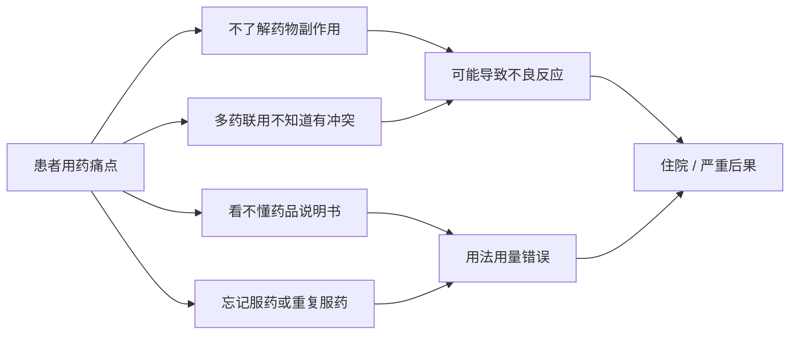

# 01 - 产品愿景与背景

## 1.1 产品愿景

> **让每个家庭都有一位"随身药师"，通过 AI Agent 技术降低用药风险，守护家庭健康。**

## 1.2 问题背景

中国是全球用药不良事件高发地区之一。据国家药品不良反应监测中心数据：

| 数据项 | 数值 |
|--------|------|
| 2023年全国药品不良反应报告 | 约 **210万份** |
| 因不合理用药导致的住院 | 占住院总数 **5%-10%** |
| 老年人多重用药（≥5种）比例 | **>40%** |
| 药物相互作用导致的不良事件 | 占不良反应报告 **~15%** |

## 1.3 核心痛点

**关键洞察**：患者有用药疑问时，就医成本高（挂号→排队→问诊）、搜索引擎答案碎片化且不可靠、药师咨询可及性低。**一个能主动识别风险、给出结构化建议的 AI Agent，恰好填补这一空白。**

## 1.4 为什么是 Agent 而不是搜索/问答？

| 对比维度 | 传统搜索/问答 | AI Agent |
|---------|-------------|---------|
| 交互方式 | 用户输入关键词 → 返回网页/文本 | 多轮对话，追问确认 |
| 数据获取 | 展示静态缓存内容 | 实时调用外部数据库（Tool Use） |
| 个性化 | 无 | 基于用药清单上下文推理 |
| 安全设计 | 无 | 紧急症状拦截、免责声明体系 |
| 主动性 | 被动等查询 | 发现风险主动预警 |
