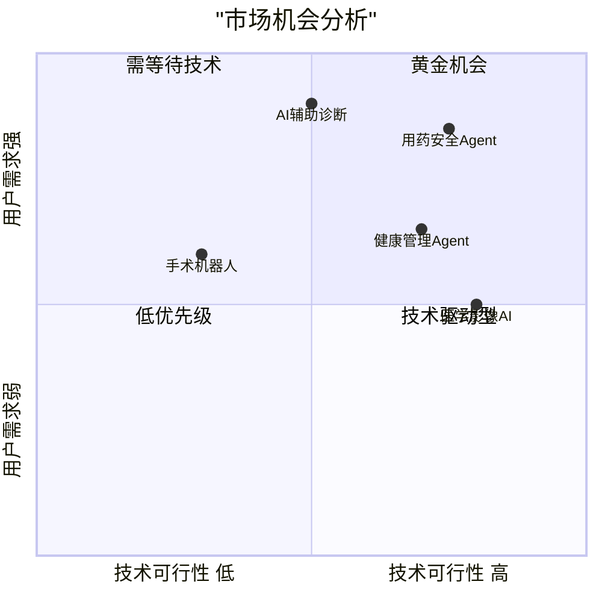

# 02 - 市场分析

## 2.1 市场规模

| 市场层次 | 范围 | 估计规模 | 数据来源 |
|---------|------|---------|---------|
| **TAM**（全球可及市场） | 全球数字健康市场 | ~$5,500亿（2025） | Statista Digital Health Report 2025 |
| **SAM**（可服务市场） | 中国互联网医疗健康市场 | ~$1,200亿（2025） | 弗若斯特沙利文《中国互联网医疗行业报告》 |
| **SOM**（可获得市场） | 用药管理 + AI健康助手细分 | ~$50-80亿 | 基于 SAM 的 4-7% 估算 |

## 2.2 行业趋势

1. **AI Agent 成为新范式**：2024-2026年，AI Agent 从概念走向落地，医疗是最重要的垂直场景之一
2. **政策利好**：《"十四五"国民健康规划》明确推动"互联网+医疗健康"，鼓励 AI 辅助诊疗
3. **大模型能力跃升**：GPT-4o / Gemini / 通义千问等在医学知识理解上已达实用水平
4. **用户教育成熟**：经过疫情教育，用户对在线健康工具的接受度大幅提升

## 2.3 市场机会分析

**结论**：用药安全 Agent 位于"高可行性 × 强需求"象限 —— 技术上无需突破性创新（调用已有数据库 + 大模型），用户需求真实且高频。

## 2.4 目标市场特征

| 特征 | 说明 |
|------|------|
| 用户规模 | 中国慢病患者超 3 亿（国家卫健委 2024），家庭用药场景覆盖 4+ 亿家庭 |
| 使用频次 | 每次新开药/换药/多药联用时触发，人均每年 3-5 次 |
| 付费意愿 | C端免费为主，B端（药房/保险/药企）有付费意愿 |
| 替代品 | 百度搜索（不可靠）、问医生（成本高）、药师咨询（可及性低） |
