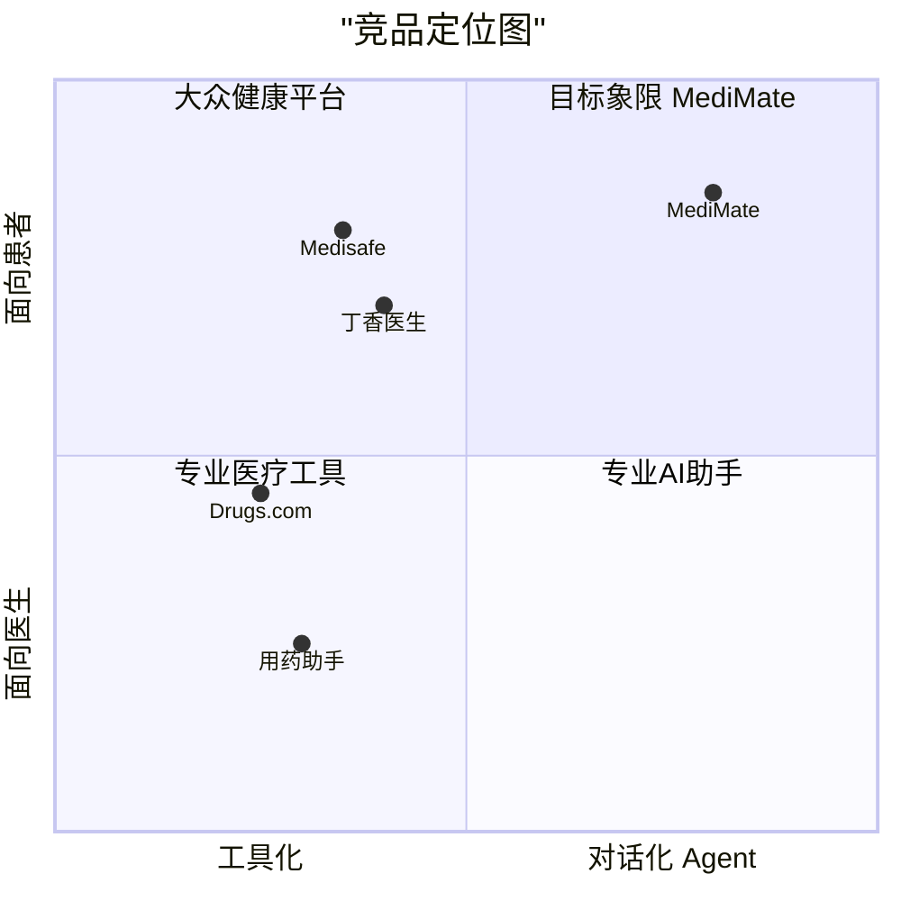

# 03 - 竞品分析

## 3.1 竞品矩阵

| 产品 | 类型 | 核心能力 | 优势 | 劣势 |
|------|------|---------|------|------|
| **用药助手**（杏树林） | 工具 App | 药品查询、说明书、相互作用 | 数据全、医生用户多 | 面向医生，普通用户门槛高；无对话能力 |
| **丁香医生** | 内容+问诊平台 | 健康科普、在线问诊 | 品牌强、内容权威 | 用药功能弱，问诊需排队付费 |
| **Drugs.com** | 工具网站 | 药物交互检查器 | 交互数据库全面 | 英文、无 Agent 能力、体验传统 |
| **Medisafe** | 服药管理 App | 服药提醒、家庭管理 | 提醒功能好 | 无药物交互检查、无 AI 对话 |
| **WebMD Symptom Checker** | AI 问诊 | 症状分析 | 用户基数大 | 非 Agent 架构，无工具调用能力 |

## 3.2 竞争定位

**MediMate 占据右上角空白区域** —— 面向患者的、对话式 Agent 产品，目前市场上没有直接竞品。

## 3.3 差异化策略

| 差异化维度 | 竞品现状 | MediMate 的独特价值 |
|-----------|---------|-------------------|
| **交互方式** | 表单/搜索框 | Agent 对话式，支持自然语言，追问确认 |
| **数据能力** | 静态知识库 | 实时调用 FDA 不良事件数据库，展示真实数据 |
| **安全机制** | 通用免责 | 检测到危险组合时主动预警，紧急症状强制就医引导 |
| **语言** | 多为英文 | 中文优先，针对中国用户的药品名称和用药习惯优化 |
| **可信度** | 不标注来源 | 每条建议标注数据来源，用户可追溯 |
| **部署方式** | 需安装 App | 纯 Web，打开即用，零安装 |

## 3.4 竞品功能对比

| 功能 | 用药助手 | 丁香医生 | Drugs.com | Medisafe | **MediMate** |
|------|---------|---------|-----------|----------|-------------|
| 药物信息查询 | ✅ | ✅ | ✅ | ❌ | ✅ |
| 药物交互检查 | ✅ | ❌ | ✅ | ❌ | ✅ |
| FDA 真实数据 | ❌ | ❌ | 部分 | ❌ | ✅ |
| 对话式交互 | ❌ | ❌ | ❌ | ❌ | ✅ |
| 多轮追问 | ❌ | ❌ | ❌ | ❌ | ✅ |
| 用药清单管理 | ❌ | ❌ | ✅ | ✅ | ✅ |
| 服药提醒 | ❌ | ❌ | ❌ | ✅ | 🔜 |
| 紧急症状识别 | ❌ | ❌ | ❌ | ❌ | ✅ |
| 中文支持 | ✅ | ✅ | ❌ | ❌ | ✅ |
| 免费使用 | 部分 | 部分 | ✅ | 部分 | ✅ |
