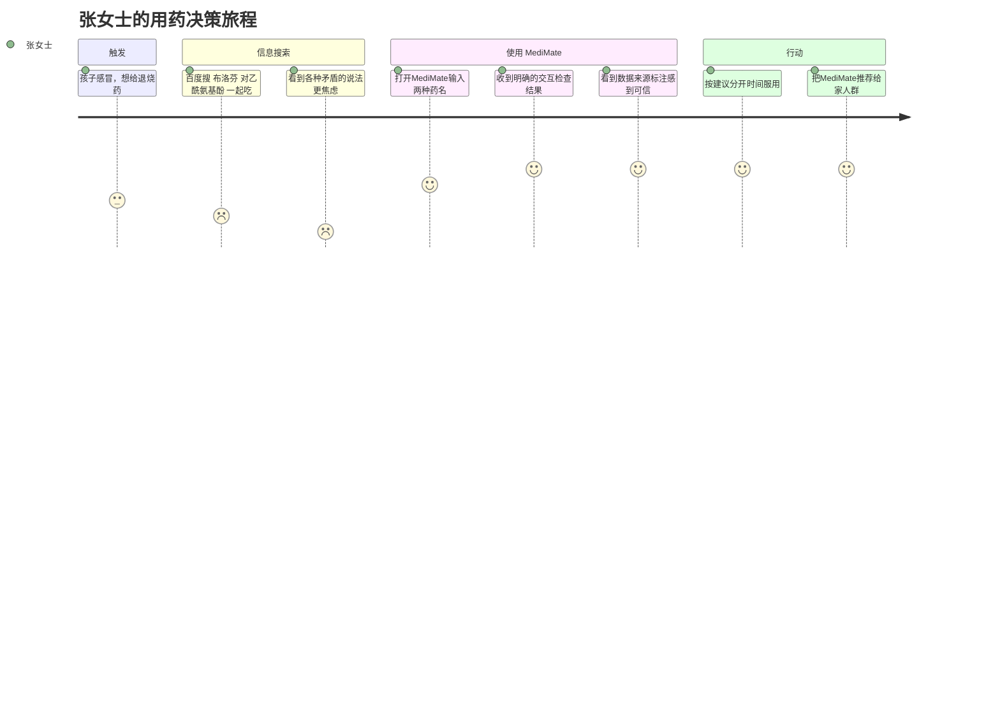

# 04 - 用户研究

## 4.1 目标用户画像

### Persona A：家庭健康管理者 — 张女士

| 维度 | 描述 |
|------|------|
| **年龄/身份** | 35岁，全职妈妈 |
| **用药场景** | 管理全家人用药（孩子感冒药、老人慢病药、自己保健品） |
| **核心痛点** | 不确定多种药能不能一起吃；孩子用药剂量该多少；保健品与处方药冲突 |
| **期望** | 快速得到可靠答案，不用每次都去医院问 |
| **使用习惯** | 手机为主，碎片化时间使用 |
| **信息获取** | 妈妈群、小红书、百度搜索 |

### Persona B：慢病患者 — 王大爷

| 维度 | 描述 |
|------|------|
| **年龄/身份** | 68岁，退休教师 |
| **用药场景** | 长期服用5种以上药物（降压、降糖、降脂、阿司匹林等） |
| **核心痛点** | 多药联用不知道有没有冲突；新加了药不确定安全性；记不住注意事项 |
| **期望** | 能帮他检查所有药物之间的冲突，给简单明了的建议 |
| **使用习惯** | 字要大，操作要简单，最好能直接说话问 |
| **信息获取** | 看病时问医生、子女帮忙查 |

### Persona C：健康焦虑的年轻人 — 李同学

| 维度 | 描述 |
|------|------|
| **年龄/身份** | 24岁，上班族 |
| **用药场景** | 偶尔感冒吃药，关注药品副作用 |
| **核心痛点** | 百度搜副作用越搜越害怕；想知道"到底严重不严重" |
| **期望** | 用数据说话，告诉他真实发生概率有多高 |
| **使用习惯** | 习惯对话式交互（ChatGPT 用户） |
| **信息获取** | 知乎、ChatGPT、小红书 |

## 4.2 用户旅程地图（Persona A 张女士）

## 4.3 需求优先级（Kano 模型）

| 需求类型 | 功能 | 用户感知 |
|---------|------|---------|
| **必备型（Must-be）** | 药物信息查询 | 没有会不满，有了不会惊喜 |
| **必备型（Must-be）** | 医疗安全免责提示 | 合规底线 |
| **期望型（One-dimensional）** | 药物相互作用检查 | 做得越好，满意度越高 |
| **期望型（One-dimensional）** | 不良反应数据查询 | 真实数据比静态知识更有价值 |
| **兴奋型（Attractive）** | FDA 真实数据可视化 | 超出预期，WOW moment |
| **兴奋型（Attractive）** | 多轮对话追问确认 | Agent 感，而非搜索框 |

## 4.4 用户场景梳理

| 场景编号 | 场景描述 | 频次 | 对应功能 |
|---------|---------|------|---------|
| S1 | 医生开了新药，想了解这个药 | 高 | 药物信息查询 |
| S2 | 同时吃好几种药，担心冲突 | 高 | 药物相互作用检查 |
| S3 | 吃药后身体不舒服，想知道是不是副作用 | 中 | 不良反应查询 |
| S4 | 想知道某个副作用到底常不常见 | 中 | FDA 数据可视化 |
| S5 | 家人吃的药想帮忙查一下 | 中 | 药物查询 + 交互检查 |
| S6 | 保健品和处方药能不能一起吃 | 低 | 药物相互作用检查 |
| S7 | 吃药后出现严重不适 | 低但紧急 | 紧急症状识别 |
