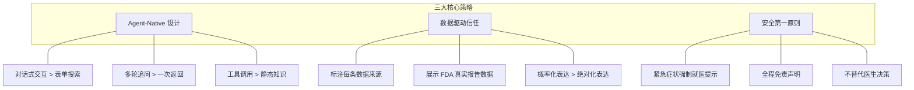

# 05 - 产品定位与策略

## 5.1 产品定位声明

> **MediMate 是一款面向普通家庭的 AI 用药安全助手。** 通过 Agent 对话式交互，帮助用户快速查询药物信息、检测药物相互作用风险、了解真实不良反应数据，**让用药决策从"百度焦虑"变为"数据安心"。**

### 一句话定位

**"用药安全领域的 AI Agent，你的随身药师。"**

## 5.2 核心策略

### 策略说明

| 策略 | 核心理念 | 体现方式 |
|------|---------|---------|
| **Agent-Native** | 用 Agent 的方式解决问题，而非传统搜索 | 多轮对话、上下文记忆、工具调用 |
| **数据驱动信任** | 用真实数据说话，而非"我觉得" | FDA 数据可视化、来源标注 |
| **安全第一** | 医疗产品的底线是不造成伤害 | 紧急拦截、免责声明、不做诊断 |

## 5.3 核心设计原则

| 原则 | 含义 | 反面案例 |
|------|------|---------|
| **可信赖（Trustworthy）** | 每条建议都标注数据来源，不编造信息 | ❌ "据说这个药副作用很大" |
| **易理解（Accessible）** | 医学术语转化为通俗表达，数据可视化降低理解门槛 | ❌ "NSAIDs 可能导致 GI bleeding" |
| **有边界（Bounded）** | 明确告诉用户 Agent 能做什么、不能做什么 | ❌ "你应该停掉这个药" |
| **主动式（Proactive）** | 检测到风险主动预警，而非被动等待查询 | ❌ 用户加了冲突药物但不提示 |

## 5.4 价值主张画布

| 维度 | 用户侧 | 产品侧 |
|------|--------|--------|
| **用户任务** | 安全地使用多种药物 | 提供药物信息 + 交互检查 |
| **痛点** | 不知道药物冲突、看不懂说明书、搜索结果不靠谱 | 结构化信息卡片、风险等级标识、数据来源标注 |
| **收益** | 安心用药、减少不必要的就医 | FDA 真实数据、个性化用药清单、紧急症状识别 |
