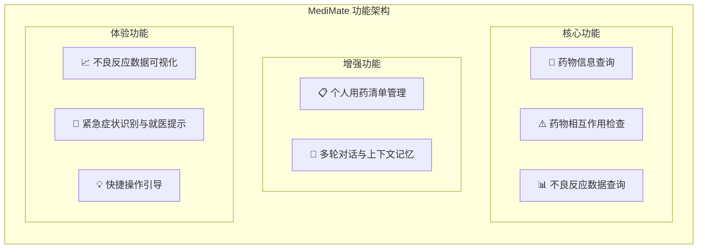
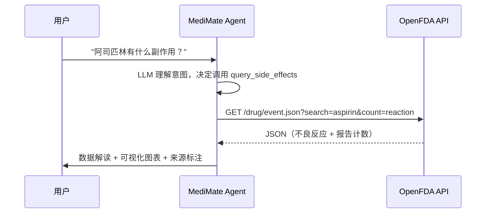

# 06 - 功能需求

## 6.1 功能架构总览



---

## 6.2 Feature 1：药物信息查询（核心功能）

**用户故事**：作为一名患者，我想通过自然语言查询某种药物的信息（用途、剂量、注意事项），以便我正确用药。

### 功能描述

| 项目 | 内容 |
|------|------|
| **触发方式** | 用户输入药物名称或相关问题（如"布洛芬是什么"、"头孢能治什么"） |
| **Agent 行为** | 识别意图 → 调用药物知识库 → 返回结构化药物信息卡片 |
| **输出形式** | 药物信息卡片（名称、分类、适应症、剂量、注意事项） |

### 信息卡片字段定义

| 字段 | 说明 | 示例 |
|------|------|------|
| 药物名称 | 中文通用名 + 英文名 | 布洛芬 (Ibuprofen) |
| 药物分类 | 药理学分类 | 非甾体抗炎药（NSAIDs） |
| 适应症 | 主要治疗用途 | 退热、镇痛、抗炎 |
| 常用剂量 | 成人推荐剂量 | 每次200-400mg，每日3-4次 |
| 注意事项 | 关键用药提醒 | 饭后服用；避免空腹；胃溃疡患者慎用 |
| 禁忌人群 | 不宜使用的人群 | 严重肝肾功能不全、活动性消化性溃疡 |

### 对话示例

```
用户：布洛芬怎么吃？

MediMate：
💊 布洛芬（Ibuprofen）

📂 分类：非甾体抗炎药（NSAIDs）
🎯 用途：退热 · 镇痛 · 抗炎
💉 常用剂量：
   成人：每次 200-400mg，每日 3-4 次，饭后服用
   日最大剂量不超过 1200mg（非处方）

⚠️ 注意事项：
   • 建议饭后服用，减少胃肠刺激
   • 胃溃疡、消化道出血患者慎用
   • 避免与阿司匹林同时使用
   • 肾功能不全者需在医生指导下使用

需要我帮你查看它和其他药物的相互作用吗？
```

### 边界情况处理

| 场景 | 处理策略 |
|------|---------|
| 药物名称拼写错误 | 模糊匹配 + 确认（"你是不是在找'阿莫西林'？"） |
| 查询数据库中没有的药物 | 明确告知，建议查阅药品说明书或咨询药师 |
| 用户输入商品名而非通用名 | 支持常见商品名映射（如"泰诺" → 对乙酰氨基酚） |
| 用户同时问多种药 | 依次展示，并主动提供交互检查 |

---

## 6.3 Feature 2：药物相互作用检查（核心功能）

**用户故事**：作为一名同时服用多种药物的患者，我想检查这些药物之间是否存在危险的相互作用，以避免不良后果。

### 功能描述

| 项目 | 内容 |
|------|------|
| **触发方式** | 用户输入两种或多种药物名称，询问是否冲突 |
| **Agent 行为** | 提取药物名称 → 两两配对检查交互数据库 → 返回风险评估 |
| **输出形式** | 交互结果卡片（风险等级 + 描述 + 建议） |

### 风险等级定义

| 等级 | 标识 | 含义 | 处理建议 |
|------|------|------|---------|
| 🔴 **严重** | `SEVERE` | 可能导致严重后果，一般应避免联用 | 强烈建议就医咨询，不应自行联用 |
| 🟡 **中度** | `MODERATE` | 可能增加不良反应风险，需谨慎 | 建议咨询医生，注意观察不适症状 |
| 🟢 **轻度** | `MILD` | 理论上可能有影响，临床意义有限 | 正常使用，注意观察即可 |
| ⚪ **未发现** | `NONE` | 数据库中未记录相互作用 | 告知未发现，但不等于绝对安全 |

### 对话示例

```
用户：我在吃华法林和阿司匹林，有问题吗？

MediMate：
⚠️ 检测到药物相互作用

🔴 风险等级：严重

┌─────────────────────────────────────┐
│  华法林（Warfarin）                  │
│         ×                            │
│  阿司匹林（Aspirin）                 │
├─────────────────────────────────────┤
│  ⚠️ 交互描述：                       │
│  两者均有抗凝/抗血小板作用，联用      │
│  可显著增加出血风险，包括消化道出血   │
│  和颅内出血。                        │
├─────────────────────────────────────┤
│  💡 建议：                           │
│  • 请勿自行联用这两种药物            │
│  • 如医生处方了两者联用，需定期       │
│    监测 INR（凝血指标）              │
│  • 出现牙龈出血、黑便、皮下瘀斑      │
│    等症状请立即就医                   │
├─────────────────────────────────────┤
│  📚 来源：药物相互作用数据库          │
└─────────────────────────────────────┘

⚕️ 重要提醒：此结果仅供参考，请务必咨询您的主治医生。
```

### 多药检查逻辑

当用户输入 ≥3 种药物时，Agent 执行两两组合检查，并按风险等级排序输出：

```
用户：我在吃二甲双胍、阿卡波糖、阿司匹林和奥美拉唑

MediMate：
🔍 正在检查 4 种药物（共 6 个组合）...

检查结果：
🟡 [中度] 二甲双胍 × 阿卡波糖
   → 联用可能增加低血糖风险，建议监测血糖
🟢 [轻度] 阿司匹林 × 奥美拉唑
   → 奥美拉唑可能轻微影响阿司匹林吸收
⚪ [安全] 其余 4 个组合未发现已知相互作用

💡 总体建议：
   整体联用方案风险可控，建议定期监测血糖水平。
   如有不适，请及时就医。
```

---

## 6.4 Feature 3：不良反应数据查询（核心功能）

**用户故事**：作为一名关注用药安全的用户，我想了解某种药物的真实不良反应数据（而非说明书上的模糊描述），以便科学评估风险。

### 功能描述

| 项目 | 内容 |
|------|------|
| **触发方式** | 用户询问某药物的副作用/不良反应 |
| **Agent 行为** | 调用 OpenFDA FAERS API → 获取该药 TOP 不良反应 → 数据可视化 |
| **输出形式** | 排序后的不良反应列表 + 条形图可视化 |
| **数据来源** | FDA 不良事件报告系统（FAERS），真实世界数据 |

> **这是本产品的最大差异化亮点。** 竞品只能展示说明书上的静态信息，MediMate 调用真实的 FDA 数据库，展示真实世界中报告频次最高的不良反应，并以数据可视化形式呈现。这体现了 Agent 的**工具调用（Tool Use）**能力。

### 工具调用流程



### 输出示例

```
用户：阿司匹林有什么副作用？

MediMate：
🔍 正在从 FDA 不良事件报告系统查询真实数据...

📊 阿司匹林（Aspirin）— TOP 10 报告最多的不良反应

  胃肠道出血   ████████████████████  12,847
  恶心         ██████████████       9,231
  头痛         ████████████         8,105
  消化不良     ██████████           6,892
  头晕         █████████            5,543
  皮疹         ████████             4,821
  呕吐         ███████              3,967
  腹痛         ██████               3,445
  疲劳         █████                2,891
  呼吸困难     ████                 2,234

📌 数据来源：FDA FAERS（不良事件报告系统）
📅 数据时间范围：1968年至今累计
📊 总报告数：约 601,477 份

⚠️ 重要说明：
   • 报告数量 ≠ 发生概率（报告存在偏差）
   • 不良事件报告不代表因果关系
   • 常见药物的报告基数通常更大
   
需要我帮你分析某个具体不良反应的详细情况吗？
```

### 数据解读策略

Agent 不仅展示数据，还要帮用户**正确理解数据**，避免"数据焦虑"：

| 解读原则 | 实现方式 |
|---------|---------|
| **避免绝对化** | 说"报告最多"而非"最常见"，标注"报告数 ≠ 发生率" |
| **提供参照** | 告知总报告数，帮助用户理解比例 |
| **区分因果** | 明确标注"不良事件报告不代表因果关系" |
| **缓解焦虑** | "阿司匹林使用已超过百年，总体安全性经过充分验证" |

---

## 6.5 Feature 4：个人用药清单管理（增强功能）

**用户故事**：作为一名长期服药的患者，我想维护一个"当前用药清单"，Agent 能记住我的用药情况并在此基础上提供建议。

### 功能说明

- 用户可添加/删除当前正在服用的药物
- 清单持久化存储在后端 PostgreSQL 数据库中
- 新添加药物时，自动与清单中已有药物进行交互检查
- Agent 在后续对话中可引用用药清单上下文

### 自动交互检查示例

```
用户：我新开了氯吡格雷

MediMate：
✅ 已将 氯吡格雷（Clopidogrel）添加到您的用药清单

📋 当前用药清单（共4种）：
   1. 阿司匹林
   2. 奥美拉唑
   3. 瑞舒伐他汀
   4. 氯吡格雷 ← 新添加

🔍 自动交互检查结果：
🟡 [中度] 氯吡格雷 × 奥美拉唑
   → 奥美拉唑可能降低氯吡格雷的抗血小板效果
   → 建议咨询医生是否需要更换为其他质子泵抑制剂（如泮托拉唑）

⚪ 其余组合未发现已知相互作用
```

---

## 6.6 Feature 5：紧急症状识别（体验功能）

**用户故事**：作为一名可能遇到紧急情况的用户，当我描述危险症状时，Agent 应立即提示我就医而非继续对话。

### System Prompt 中定义的安全规则覆盖场景

```
紧急场景（System Prompt 中标注为最高优先级）：
- 呼吸困难 / 喘不上气 / 呼吸急促
- 胸痛 / 胸闷 / 心绞痛
- 大量出血 / 吐血 / 便血
- 意识模糊 / 昏迷 / 晕倒
- 严重过敏 / 过敏性休克 / 全身起疹
- 自杀 / 想死 / 不想活
```

### 响应模板

```
MediMate：
🚨 紧急提醒

您描述的症状可能需要立即就医。
请不要依赖任何在线工具，立即采取以下措施：

📞 拨打急救电话：120
🏥 前往最近的医院急诊科

如果身边有人，请告知他们您的情况。

⚕️ MediMate 无法替代紧急医疗救治。您的健康和安全是第一位的。
```

### 设计要点

| 要点 | 说明 |
|------|------|
| **优先级最高** | 安全规则在 System Prompt 中标注为最高优先级，LLM 优先判断紧急情况 |
| **宁滥勿缺** | 宁可误报，也不漏报紧急情况 |
| **阻断对话** | 一旦触发，不再回答用药相关问题 |
| **提供行动** | 给出具体的就医方式（120电话、急诊科） |
