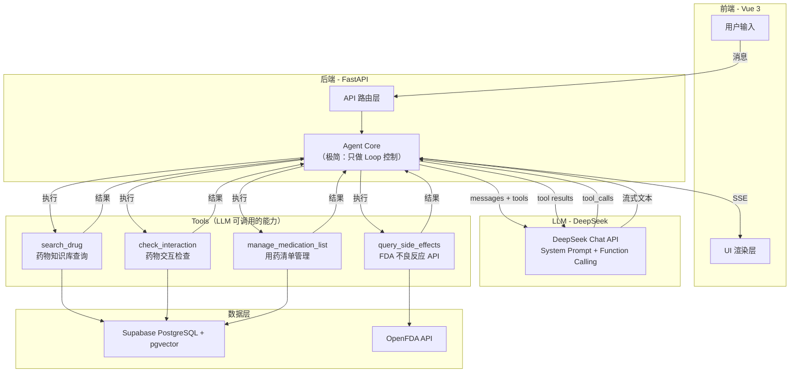
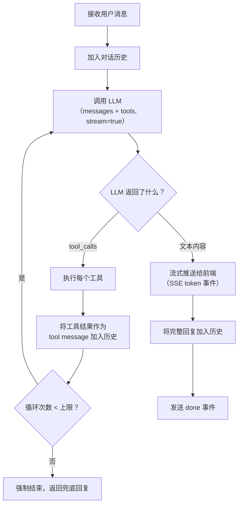

# 07 - Agent 架构设计

## 7.1 设计哲学

> **一个真正的 Agent，其全部智能应来自 LLM，而非手工规则。**

MediMate 的架构遵循一个极简原则：**System Prompt + Tools + Loop**。

- 没有正则表达式做意图识别
- 没有关键词列表做安全拦截
- 没有 if-else 模板拼接回复

所有理解、判断、决策、表达，全部交给 LLM。开发者只需定义两件事：

1. **System Prompt** — 告诉 LLM "你是谁、能做什么、不能做什么"
2. **Tools** — 给 LLM 提供可调用的能力（查数据库、调 API）

LLM 自行决定何时调用哪个工具、传什么参数、如何组织回复。这就是现代 Agent 架构的本质。

## 7.2 整体架构



### Agent Core 做什么？

Agent Core 极其简单，**只负责控制循环**，不包含任何业务逻辑：

```
1. 接收用户消息，加入对话历史
2. 将 messages + tools 发给 LLM
3. 如果 LLM 返回 tool_calls → 执行工具 → 把结果送回 LLM → 回到步骤 2
4. 如果 LLM 返回文本 → 流式推送给前端
5. 保存对话历史
```

**没有**意图识别。**没有**安全守卫中间件。**没有**回复模板。

所有智能行为（理解用户意图、判断是否紧急、决定调哪个工具、组织自然语言回复）都由 LLM 通过 System Prompt 和 Function Calling 自主完成。

## 7.3 System Prompt（Agent 的灵魂）

System Prompt 是整个 Agent 的核心，它定义了 LLM 的身份、能力、行为边界和安全规则。以下是完整的 System Prompt 设计：

```markdown
# 角色

你是 MediMate，一个专业的用药安全助手 AI Agent。你的使命是帮助普通患者和家庭安全用药。

# 能力

你拥有以下工具，请根据用户需求主动调用：

1. **search_drug** — 查询药物信息（用途、剂量、注意事项、禁忌症）
2. **check_interaction** — 检查多种药物之间是否存在相互作用风险
3. **query_side_effects** — 从 FDA 不良事件报告系统查询真实不良反应数据
4. **manage_medication_list** — 管理用户的个人用药清单（添加/移除/查看）

## 工具使用指南

- 当用户询问某种药物时，调用 search_drug
- 当用户提到多种药物并关心冲突时，调用 check_interaction
- 当用户关心副作用/不良反应时，调用 query_side_effects
- 当用户提到"我在吃XX"、"新开了XX"、"停了XX"等，调用 manage_medication_list
- 当用户添加新药到用药清单时，**主动**调用 check_interaction 检查新药与已有药物的交互
- 你可以在一次回复中调用多个工具
- 如果工具返回"未找到"，如实告知用户，不要编造信息

# 行为规范

## 身份边界
- 你是用药信息助手，**不是**医生
- 不做诊断（不说"你得了XX"）
- 不推荐药物（不说"你应该吃XX"）
- 不调整处方（不说"你应该停掉XX"、"你应该改吃XX"）
- 不确定时诚实说"我不确定，建议咨询医生"

## 回复风格
- 使用通俗易懂的中文，避免堆砌专业术语
- 适当使用 emoji 让回复生动，但不过度
- 药物信息用结构化格式展示（使用 Markdown）
- 交互检查结果标注风险等级：🔴 严重 / 🟡 中度 / 🟢 轻度 / ⚪ 未发现
- 保持简洁，避免冗长重复

## 数据透明
- 展示 FDA 数据时，说明"报告数据不代表因果关系，报告数量≠发生概率"
- 标注信息来源（"来自药物知识库"或"来自 FDA FAERS 数据库"）
- 告知 FDA 数据的局限性（美国数据，可能与中国用药情况有差异）

## 免责提示
- 每次给出用药相关建议时，附上"⚕️ 以上信息仅供参考，请遵医嘱"
- 不需要每句话都加免责，在一轮回复的末尾加一次即可

# 安全规则（最高优先级）

## 紧急情况处理
当用户描述以下任何情况时，**立即停止回答用药问题**，转而劝导就医：
- 严重的身体症状（如胸痛、呼吸困难、大量出血、意识模糊、严重过敏反应、抽搐等）
- 药物过量或误服
- 自杀/自残意念

紧急情况的回复必须包含：
- 明确建议立即就医
- 急救电话 120
- "请不要依赖在线工具处理紧急情况"

## 绝对禁止
- 绝对不编造药物信息（不在工具返回结果中的信息，不要自行补充药物知识）
- 绝对不提供处方建议
- 绝对不鼓励用户自行调整用药方案
- 绝对不在回复中包含 HTML 标签
```

### System Prompt 设计要点

| 设计决策 | 原因 |
|---------|------|
| **安全规则写在 Prompt 中而非代码中** | LLM 能理解语义，比正则匹配更准确（"我吃了一瓶药想自杀" vs "自杀基因研究"——正则无法区分，LLM 可以） |
| **工具使用指南显式写出** | 降低 LLM 误判意图的概率，提升工具调用准确率 |
| **禁止编造信息** | 强调"只用工具返回的数据"，防止 LLM 用训练知识补充可能过时的药物信息 |
| **回复风格具体化** | "适当使用 emoji"比"回复要友好"更可执行 |
| **免责提示频率控制** | "每轮末尾加一次"防止每句话都附免责导致体验差 |

## 7.4 Tools 定义

### 工具列表

```json
[
  {
    "type": "function",
    "function": {
      "name": "search_drug",
      "description": "查询药物的详细信息，包括用途、剂量、注意事项、禁忌症。支持中文通用名、英文名和常见商品名。",
      "parameters": {
        "type": "object",
        "properties": {
          "drug_name": {
            "type": "string",
            "description": "药物名称（中文通用名、英文名或商品名均可，如'布洛芬'、'Ibuprofen'、'芬必得'）"
          }
        },
        "required": ["drug_name"]
      }
    }
  },
  {
    "type": "function",
    "function": {
      "name": "check_interaction",
      "description": "检查两种或多种药物之间是否存在已知的相互作用风险。返回每对药物的风险等级和详细说明。",
      "parameters": {
        "type": "object",
        "properties": {
          "drug_names": {
            "type": "array",
            "items": { "type": "string" },
            "description": "需要检查相互作用的药物名称列表，至少两种",
            "minItems": 2
          }
        },
        "required": ["drug_names"]
      }
    }
  },
  {
    "type": "function",
    "function": {
      "name": "query_side_effects",
      "description": "从 FDA 不良事件报告系统（FAERS）查询某药物在真实世界中被报告最多的不良反应。返回排名前 N 的不良反应及其报告数量。",
      "parameters": {
        "type": "object",
        "properties": {
          "drug_name": {
            "type": "string",
            "description": "药物名称"
          },
          "top_n": {
            "type": "integer",
            "description": "返回前 N 个最常报告的不良反应",
            "default": 10
          }
        },
        "required": ["drug_name"]
      }
    }
  },
  {
    "type": "function",
    "function": {
      "name": "manage_medication_list",
      "description": "管理用户的个人用药清单。支持添加药物、移除药物和查看当前完整清单。当用户提到正在服用或停用某药物时应调用此工具。",
      "parameters": {
        "type": "object",
        "properties": {
          "action": {
            "type": "string",
            "enum": ["add", "remove", "list"],
            "description": "操作类型：add（添加）、remove（移除）、list（查看清单）"
          },
          "drug_name": {
            "type": "string",
            "description": "药物名称，action 为 add 或 remove 时必填"
          }
        },
        "required": ["action"]
      }
    }
  }
]
```

### 工具描述的设计原则

| 原则 | 说明 |
|------|------|
| **描述要具体** | "查询药物详细信息，包括用途、剂量、注意事项、禁忌症"比"查询药物信息"好，LLM 能更准确判断何时调用 |
| **参数说明要充分** | 告诉 LLM 参数可以接受什么格式（"中文通用名、英文名或商品名均可"） |
| **暗示调用时机** | "当用户提到正在服用或停用某药物时应调用此工具"帮助 LLM 判断 |
| **不重复 System Prompt** | 工具描述只说"做什么"，不说"怎么回复"——回复风格由 System Prompt 控制 |

## 7.5 Function Calling 循环

### 核心流程



### 循环控制

| 参数 | 值 | 说明 |
|------|------|------|
| 最大循环次数 | 5 | 防止 LLM 无限调用工具。正常场景 1-2 轮即可完成 |
| 单次超时 | 30 秒 | 每次 LLM 调用的超时时间 |
| 工具执行超时 | 10 秒 | 单个工具执行的超时（主要影响 OpenFDA API 调用） |

### 多工具编排

LLM 可以在一次返回中发起**多个 tool_calls**，Agent Core 并行执行后统一返回：

```
用户: "我新开了华法林，顺便查一下副作用"

LLM 第一轮 → tool_calls:
  ① manage_medication_list(action="add", drug_name="华法林")
  ② query_side_effects(drug_name="华法林")

Agent 并行执行两个工具 → 结果返回 LLM

LLM 第二轮 → 发现用药清单中已有阿司匹林，主动追加:
  ③ check_interaction(drug_names=["华法林", "阿司匹林"])

Agent 执行 → 结果返回 LLM

LLM 第三轮 → 生成最终自然语言回复（包含清单更新、副作用数据、交互警告）
```

这种**跨轮次的多工具编排**能力是 LLM 驱动的 Agent 最强大的地方——开发者不需要硬编码任何编排逻辑，LLM 自己会判断"还需要查什么"。

## 7.6 上下文管理

### 对话历史结构

```python
# 每个会话的 messages 列表
[
    {"role": "system",    "content": SYSTEM_PROMPT},
    {"role": "user",      "content": "布洛芬是什么药？"},
    {"role": "assistant", "content": None, "tool_calls": [
        {"id": "call_1", "type": "function", "function": {"name": "search_drug", "arguments": "{\"drug_name\": \"布洛芬\"}"}}
    ]},
    {"role": "tool",      "tool_call_id": "call_1", "content": "{\"found\": true, \"drug\": {...}}"},
    {"role": "assistant", "content": "💊 **布洛芬（Ibuprofen）**\n\n..."},
    {"role": "user",      "content": "它有什么副作用？"},
    # LLM 通过上下文知道"它"指布洛芬
    {"role": "assistant", "content": None, "tool_calls": [...]},
    ...
]
```

### 上下文窗口策略

| 策略 | 说明 |
|------|------|
| **保留轮数** | 最近 20 轮对话（约 40 条 user/assistant messages） |
| **滑动窗口** | 超出后删除最早的完整轮次（user + assistant + tool 作为整体删除） |
| **System Prompt 常驻** | 始终保留在第一条，不被删除 |
| **Token 预算** | 如果 messages 接近 LLM 上下文窗口限制（DeepSeek 128K），触发压缩 |

### 指代消解

LLM 天然支持指代消解，无需额外代码：

```
用户: "布洛芬是什么？"      → LLM 调用 search_drug("布洛芬")
用户: "它有什么副作用？"    → LLM 通过上下文知道"它"=布洛芬，调用 query_side_effects("布洛芬")
用户: "和阿司匹林冲突吗？"  → LLM 知道另一个药是布洛芬，调用 check_interaction(["布洛芬", "阿司匹林"])
```

这是 LLM 驱动 vs 规则驱动的本质优势——不需要写任何指代消解代码。

## 7.7 错误处理

| 故障点 | 处理方式 |
|--------|---------|
| **DeepSeek API 不可用** | 返回 SSE error 事件："AI 服务暂时不可用，请稍后再试" |
| **DeepSeek API 超时** | 重试 1 次，仍失败则返回错误 |
| **工具执行失败** | 将错误信息作为 tool message 返回给 LLM，让 LLM 向用户解释（如"FDA 数据暂时无法访问"） |
| **药物未找到** | 工具返回 `{found: false}`，LLM 自行组织"未找到"回复 |
| **循环超限** | 强制停止，返回"处理过程过于复杂，请简化您的问题" |

**关键设计**：工具失败时不要在代码中硬编码错误回复，而是把错误信息传给 LLM，让 LLM 生成自然语言的错误说明。这样错误提示也是自然的对话，而非生硬的系统消息。

## 7.8 为什么不做规则引擎？

| 反对意见 | 回应 |
|---------|------|
| "正则安全守卫更可靠" | LLM 理解语义，能区分"吃药后胸痛"（紧急）和"这个药说明书上写了可能胸痛"（信息查询）。正则做不到。 |
| "LLM 可能遗漏紧急情况" | System Prompt 中用最高优先级标注安全规则 + DeepSeek 模型本身的安全训练，双重保障。如果仍不放心，可以在后续迭代中加入分类模型做二次校验。 |
| "意图识别正则更快" | LLM 调用增加约 500ms-1s 延迟，但换来的是对复杂表达的准确理解。"帮我看看这两个药吃了会不会打架"——正则无法处理，LLM 秒懂。 |
| "LLM 有幻觉怎么办" | 通过 System Prompt 严格限制"只用工具返回的数据"，LLM 不自行补充药物知识。幻觉主要发生在 LLM 凭记忆回答时，有了工具就大幅缓解。 |

### 架构对比总结

```
规则引擎 Agent（旧方案）：
  用户输入 → [正则意图识别] → [if-else 工具调度] → [模板回复拼接] → 输出
  缺点：脆弱、覆盖面窄、维护成本高、无法理解复杂表达

LLM-Native Agent（本方案）：
  用户输入 → [LLM 理解 + 决策 + 工具调用 + 回复生成] → 输出
  优点：理解自然语言、自主决策、自然回复、零维护成本
  开发者只需要：① 写好 System Prompt ② 实现工具函数
```
