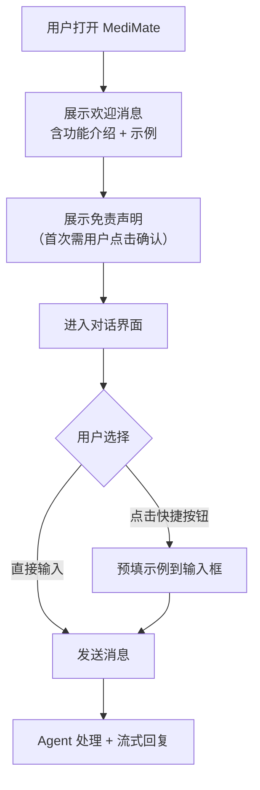
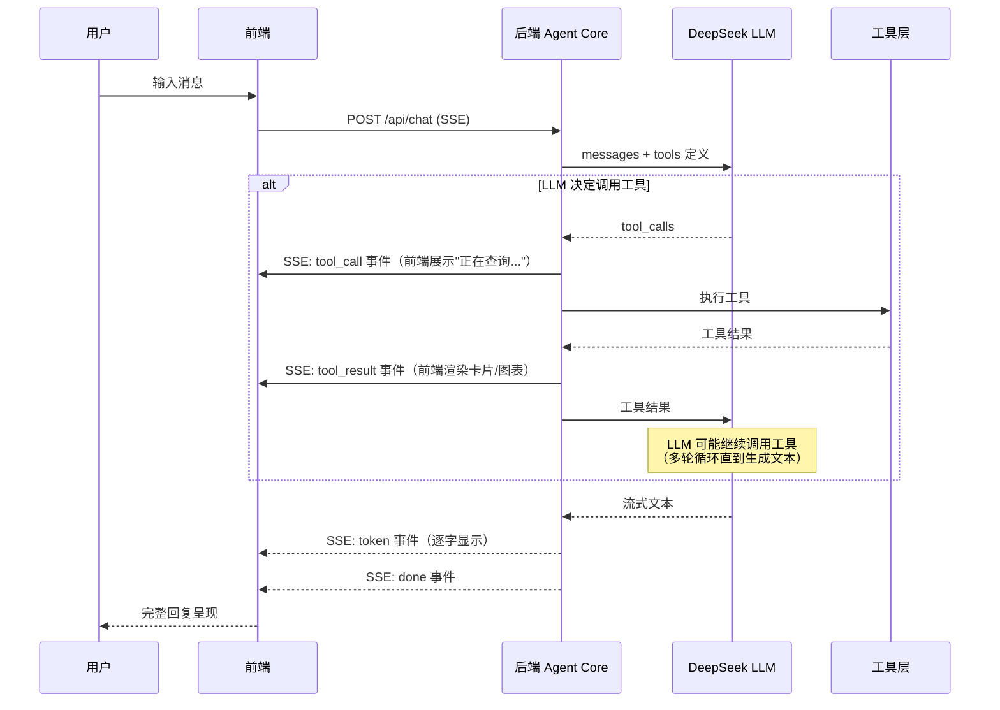

# 08 - 交互设计

## 8.1 首次使用流程



## 8.2 欢迎消息

```
👋 你好，我是 MediMate — 你的智能用药助手

我可以帮你：
💊 查询药物信息 — 用途、剂量、注意事项
⚠️ 检查药物相互作用 — 多种药能不能一起吃
📊 查看不良反应数据 — 来自 FDA 真实报告
📋 管理用药清单 — 记录你正在吃的药

⚕️ 声明：我提供的信息仅供参考，不构成医疗建议。用药请遵医嘱。

你可以直接用自然语言问我任何用药问题，比如：
  "布洛芬和阿司匹林能一起吃吗？"
  "对乙酰氨基酚有什么副作用？"
  "我在吃降压药和降糖药，帮我查一下有没有冲突"
```

## 8.3 核心交互流程

整个交互流程由 LLM 自主驱动，无需预定义任何流程分支：



### 交互特点

| 特点 | 说明 |
|------|------|
| **无预设流程** | 用户可以用任何方式表达任何需求，LLM 自行理解 |
| **多轮对话** | LLM 通过对话历史记住上下文，支持"它"、"那个药"等指代 |
| **主动追问** | 信息不完整时 LLM 自己会追问，无需编码追问逻辑 |
| **多工具编排** | LLM 可在一次交互中自主调用多个工具 |
| **流式输出** | 回复逐字出现，等待感降低 |

## 8.4 对话示例

### 示例 1：简单药物查询

```
用户: 布洛芬怎么吃？
Agent: [调用 search_drug("布洛芬")]

💊 **布洛芬（Ibuprofen）**

📂 分类：非甾体抗炎药（NSAIDs）
🎯 用途：退热 · 镇痛 · 抗炎

💉 **常用剂量**
成人：每次 200-400mg，每日 3-4 次
日最大剂量不超过 1200mg（非处方）
服法：饭后口服

⚠️ **注意事项**
• 建议饭后服用，减少胃肠刺激
• 胃溃疡、消化道出血患者慎用
• 肾功能不全者需在医生指导下使用

🚫 **禁忌**：严重肝肾功能不全、活动性消化性溃疡、对NSAIDs过敏、妊娠晚期

需要了解更多信息吗？比如它和其他药物的相互作用，或者副作用数据。

⚕️ 以上信息仅供参考，请遵医嘱。
```

### 示例 2：多药交互检查

```
用户: 我爸在吃华法林、阿司匹林和奥美拉唑，有没有冲突？
Agent: [调用 check_interaction(["华法林", "阿司匹林", "奥美拉唑"])]

🔍 为您检查了 3 种药物（共 3 个组合）：

🔴 **严重** — 华法林 × 阿司匹林
两者均有抗凝/抗血小板作用，联用可显著增加出血风险。
💡 建议：请咨询医生是否需要调整方案。如已联用，需定期监测 INR。

🟡 **中度** — 华法林 × 奥美拉唑
奥美拉唑可能影响华法林代谢，增强抗凝效果。
💡 建议：联用期间需密切监测 INR，必要时调整华法林剂量。

⚪ **未发现** — 阿司匹林 × 奥美拉唑
数据库中未记录该组合的显著相互作用。

⚠️ 您父亲的用药组合中存在一个**严重**交互风险（华法林+阿司匹林），建议尽早与主治医生沟通确认。

⚕️ 以上信息仅供参考，请遵医嘱。
```

### 示例 3：上下文追问（LLM 自主能力）

```
用户: 布洛芬是什么？
Agent: [调用 search_drug] → 展示药物信息

用户: 它有什么副作用？
Agent: [LLM 通过上下文理解"它"=布洛芬，调用 query_side_effects("布洛芬")]
→ 展示 FDA 数据条形图

用户: 和阿司匹林冲突吗？
Agent: [LLM 理解另一个药是布洛芬，调用 check_interaction(["布洛芬", "阿司匹林"])]
→ 展示交互结果

用户: 帮我记一下，我在吃阿司匹林
Agent: [调用 manage_medication_list(action="add", drug_name="阿司匹林")]
→ 添加成功
```

### 示例 4：复杂请求（多工具编排）

```
用户: 我新开了氯吡格雷，之前一直在吃阿司匹林和奥美拉唑，帮我查一下有没有问题，顺便看看氯吡格雷的副作用

Agent:
  [第1轮 tool_calls]
    ① manage_medication_list(add, "氯吡格雷")
    ② check_interaction(["氯吡格雷", "阿司匹林", "奥美拉唑"])
    ③ query_side_effects("氯吡格雷")

  [工具结果返回后，LLM 组织完整回复]

✅ 已将**氯吡格雷**添加到您的用药清单。

📋 当前清单：阿司匹林、奥美拉唑、氯吡格雷

---

🔍 **交互检查结果（3种药，3个组合）**

🔴 **严重** — 氯吡格雷 × 奥美拉唑
奥美拉唑会抑制 CYP2C19 酶，降低氯吡格雷的活性代谢物生成，可能显著减弱其抗血小板效果。
💡 建议咨询医生是否需要更换为泮托拉唑等影响较小的质子泵抑制剂。

🟡 **中度** — 氯吡格雷 × 阿司匹林
... ...

---

📊 **氯吡格雷 — FDA 不良反应数据**
[条形图]
... ...
```

### 示例 5：紧急情况（LLM 自主判断）

```
用户: 我吃了华法林之后一直在吐血，怎么办

Agent:  ← LLM 根据 System Prompt 中的安全规则自主判断

🚨 **您描述的情况非常紧急！**

吐血可能是严重出血的表现，尤其是在服用华法林（抗凝药）的情况下，需要**立即就医**。

📞 **请立即拨打 120 急救电话**
🏥 **或前往最近的医院急诊科**

在等待救援期间：
• 保持冷静，不要随意走动
• 如果仍在呕血，侧卧防止误吸
• 告知医生您正在服用华法林

请不要依赖任何在线工具处理这种情况。您的安全是最重要的。
```

## 8.5 前端交互细节

### 流式展示

| 阶段 | 前端表现 |
|------|---------|
| Agent 开始处理 | 显示 LoadingDots 跳动动画 |
| 收到 tool_call 事件 | 显示 "🔍 正在查询药物信息..." / "📊 正在获取FDA数据..." |
| 收到 tool_result 事件 | 渲染对应的卡片/图表组件 |
| 收到 token 事件 | 逐字追加文本，Markdown 实时渲染 |
| 收到 done 事件 | 隐藏加载动画，完成本轮对话 |

### 快捷操作按钮

| 按钮 | 效果 |
|------|------|
| 💊 查询药物 | 输入框预填 "请帮我查一下" 并聚焦 |
| ⚠️ 检查交互 | 输入框预填 "___和___能一起吃吗？" |
| 📊 查副作用 | 输入框预填 "___有什么副作用？" |
| 📋 我的用药 | 直接发送 "查看我的用药清单" |

### 响应式设计

| 屏幕 | 布局 |
|------|------|
| 桌面端 (>1024px) | 左侧面板(280px) + 右侧对话区 |
| 平板端 (768-1024px) | 侧面板可收起 |
| 手机端 (<768px) | 单栏，侧面板变为底部抽屉 |

## 8.6 交互设计哲学

> **最好的交互设计是没有设计。**

用户不需要学习"怎么和 MediMate 对话"。他们用最自然的方式提问，LLM 负责理解和回应。

- 不需要记住命令格式
- 不需要按特定顺序操作
- 不需要使用特定关键词
- 想到什么问什么，LLM 都能处理
