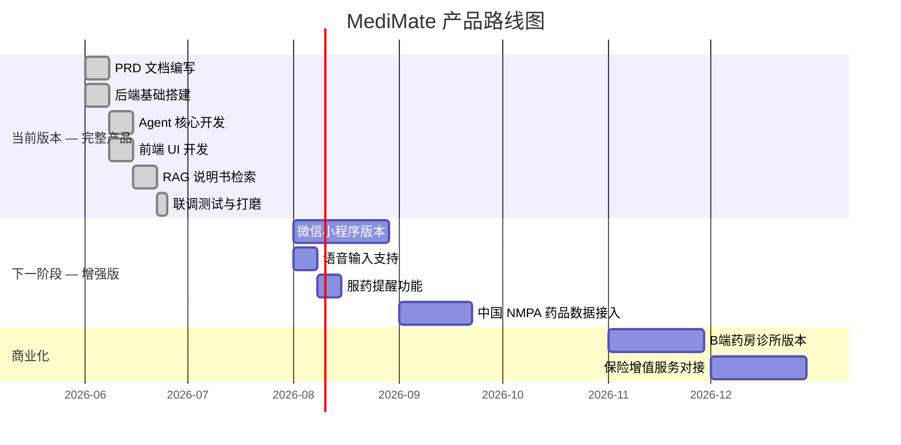
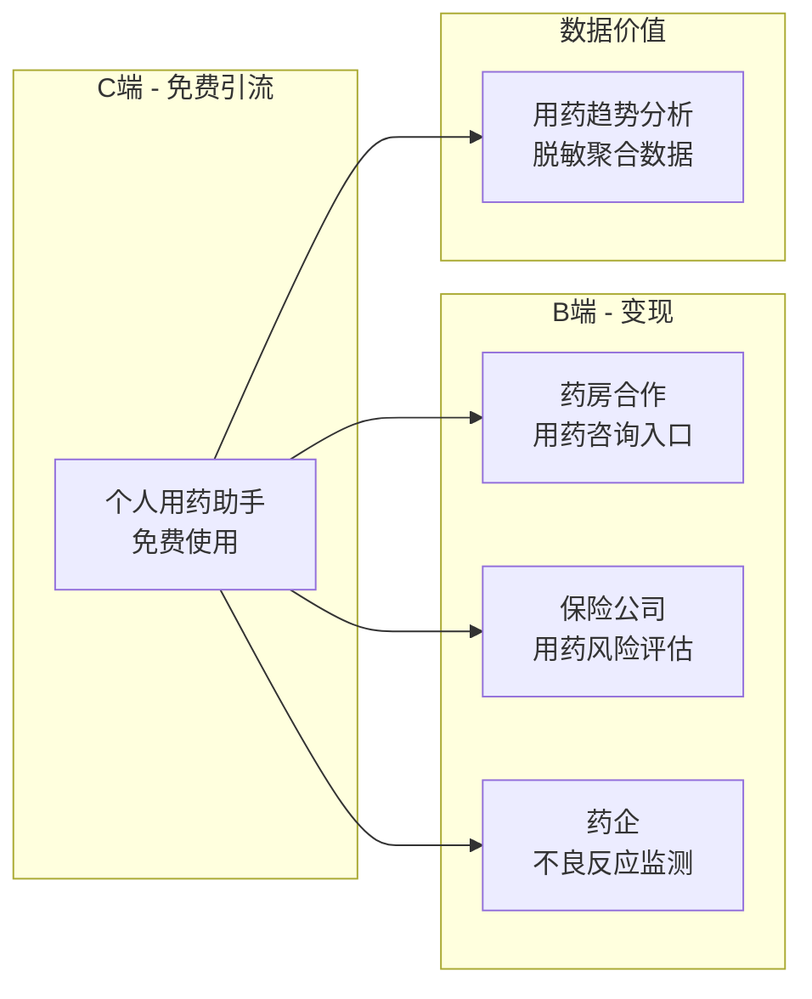

# 13 - Roadmap

## 13.1 阶段规划总览

## 13.2 各阶段详细说明

### Phase 1：完整产品（已完成）

**目标**：功能完整的全栈 AI Agent 产品

| 交付物 | 说明 |
|--------|------|
| Web 应用 | Vue 3 + FastAPI + DeepSeek，深色主题玻璃拟态 UI |
| PRD 文档 | 产品愿景、市场分析、竞品分析、用户研究、功能规格、架构设计 |
| 药物知识库 | RAG 语义检索，200+ 种常用药说明书向量化 |
| Agent 核心 | System Prompt + Function Calling + 4 个工具 + SSE 流式输出 |
| OpenFDA 集成 | 不良反应真实数据查询 + 可视化 |

**核心功能**：
- ✅ 药物信息查询（RAG 语义检索药品说明书）
- ✅ 药物相互作用检查（RAG 增强多药冲突检测）
- ✅ FDA 不良反应数据可视化（OpenFDA FAERS 实时查询）
- ✅ 个人用药清单（Supabase PostgreSQL 持久化存储）
- ✅ 多工具编排（LLM 自主组合多个工具调用）
- ✅ 紧急症状识别（双层安全机制：正则硬兜底 + LLM 语义判断）
- ✅ 流式对话（SSE 逐字输出 + 打字机效果）

**技术选型**：Vue 3 + FastAPI + DeepSeek Function Calling + Supabase pgvector + OpenFDA API

---

### Phase 2：增强版（+2 个月）

**目标**：多端覆盖 + 中国数据源

| 升级项 | 说明 |
|--------|------|
| 小程序 | 微信小程序版本，扩大用户触达 |
| 语音输入 | 支持语音转文字，适配老年用户 |
| 服药提醒 | 基于用药清单定时推送提醒 |
| 数据升级 | 接入中国 NMPA 药品数据 |

---

### Phase 3：商业化（+3 个月）

**目标**：B 端变现

| 方向 | 说明 |
|------|------|
| B端合作 | 为连锁药房、诊所提供嵌入式用药助手 |
| 保险增值 | 为健康险公司提供用药风险评估 |
| DTP 药房 | 对接药房 API，支持在线购药 |

## 13.3 商业化路径思考

### 商业模式分析

| 模式 | 付费方 | 价值 | 可行性 |
|------|--------|------|--------|
| **药房 SaaS** | 连锁药房 | 提升药师咨询效率，增加用户粘性 | ⭐⭐⭐⭐ |
| **保险增值服务** | 健康险公司 | 降低用药风险，减少理赔 | ⭐⭐⭐ |
| **药企洞察** | 制药公司 | 真实世界用药数据洞察 | ⭐⭐⭐ |
| **用户付费** | C端用户 | 高级功能（详细报告、家庭共享） | ⭐⭐ |

## 13.4 技术演进路径

| 阶段 | 核心能力 | 数据源 | 部署 |
|------|---------|--------|------|
| **当前版本** | LLM Function Calling + RAG 语义检索 + 4 工具 | 说明书向量库 + OpenFDA | Vue + FastAPI + Supabase |
| **增强版** | + 小程序 + 语音输入 + 服药提醒 | + NMPA 中国数据 | 小程序 + 云服务 |
| **商业版** | + B端 API + 保险增值 | + 药房 API | SaaS 多租户 |

## 13.5 里程碑

| 里程碑 | 时间 | 标志 |
|--------|------|------|
| 📝 PRD 完成 | 2026年6月 | 全部 14 份产品文档完成 |
| 🏁 完整产品开发完成 | 2026年7月 | 全栈 LLM Agent + RAG 可演示 |
| 📝 简历投递 | 2026年7月 | 将项目写入简历，开始投递 |
| 🎤 面试演示 | 2026年7-9月 | 面试中现场演示 |
| 🚀 增强版上线 | 2026年9月 | 小程序 + 语音 + NMPA 数据 |
| 📱 商业化 | 2026年12月 | B 端 SaaS 付费版本 |
