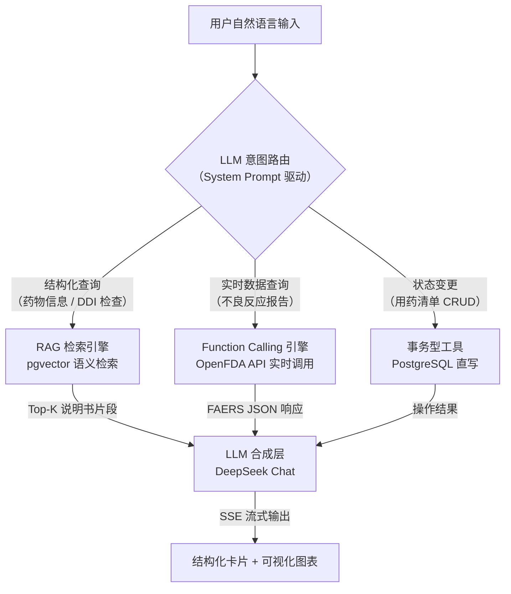
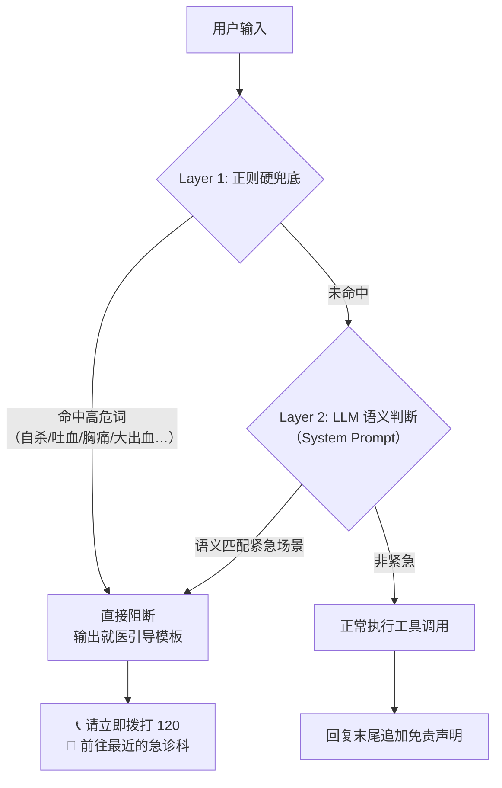
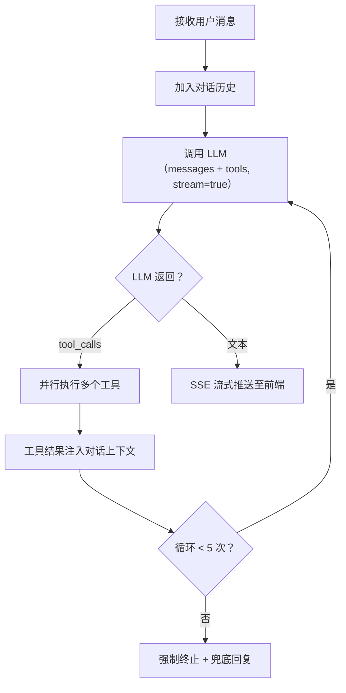

# MediMate — AI 用药安全助手 · 产品概要

> **一句话定位**：面向 C 端患者的用药安全 AI Agent，基于 LLM Function Calling + RAG 双引擎架构，将"百度搜药"升级为"对话式审方"。
>
> **角色**：独立项目 · AI PM + 全栈 Owner | **状态**：完整产品已交付

---

## 1. 产品定义

### 1.1 我们解决什么问题

- **核心数据**：中国年药品不良反应报告 **210 万份**，约 15% 源于多药相互作用（DDI）；老年患者多重用药（≥5 种）比例 **>40%**。
- **用户现状**：搜索引擎返回碎片化信息，无法交叉验证多药冲突；丁香医生/用药助手面向医生，C 端患者缺乏"翻译层"。
- **产品假设**：将 LLM 的语义理解 + 实时工具调用能力引入用药咨询场景，让患者用自然语言完成"查询 → 交叉检查 → 风险评估"闭环。

### 1.2 与 ChatGPT 的差异（面试官常问）

| 维度 | 通用 Chatbot | MediMate Agent |
|------|-------------|----------------|
| **知识来源** | 模型训练记忆（静态、可能幻觉） | 工具返回的结构化数据 + FDA 实时 API |
| **推理链路** | 单轮文本生成 | 多轮 Function Calling 循环（决策→调用→验证→回复） |
| **安全机制** | 通用 RLHF 对齐 | 领域特化 System Prompt + 四级免责声明 + 紧急症状强制阻断 |
| **可观测性** | 黑盒 | 每次工具调用可追踪、可审计 |

[建议放入飞书折叠面板] **市场定位补充**：TAM 全球数字健康 ~$5500 亿，中国互联网医疗 ~$1200 亿。MediMate 切入"患者侧 AI 审方"空白象限——现有竞品均面向医生或为英文产品，无直接竞品。C 端免费引流，B 端（连锁药房 SaaS / 保险增值）为商业化路径。

---

## 2. 核心架构：双引擎分流设计

这是本产品作为 **AI Native 产品** 最重要的架构决策。

> **路由逻辑**：LLM 根据 System Prompt 中的工具描述自主判断调用哪个引擎——非规则路由，无硬编码分支。同一个用户 query 可能触发多引擎并行调用（如"新加了华法林，查副作用"→ 同时触发清单写入 + DDI 检查 + FDA 查询）。

### 2.1 RAG 引擎（离线知识）

- **覆盖**：200+ 种常用药说明书，BGE-M3 嵌入（1024 维），存入 Supabase pgvector。
- **触发条件**：用户 query 涉及药物基础信息（适应症、剂量、禁忌）或 DDI 组合查询。
- **优势**：检索结果可溯源至说明书原文，**从架构层面抑制幻觉**——LLM 仅做摘要与翻译，不依赖记忆补充药物知识。
- **切片策略（面试官大概率追问）**：药品说明书是高度结构化的长文本。我们**不按字符数粗暴切分**，而是**按说明书原有的标题层级进行结构化切片**——以 `[药物名]` 为顶层文档，按 `## 适应症`、`## 用法用量`、`## 不良反应`、`## 禁忌`、`## 药物相互作用` 等标准章节边界切块，每块独立嵌入。检索时返回的是一段**语义完整、上下文自包含**的章节原文，而非被截断的碎片。这样做的好处：用户问"布洛芬孕妇能吃吗" → 直接命中 `禁忌` 章节块，Top-3 召回内必含孕妇相关内容，不会被"用法用量"块干扰。

[建议放入飞书折叠面板] **切片参考示例**：以布洛芬说明书为例，最终产生 6-8 个 chunks——`[布洛芬_适应症]`、`[布洛芬_用法用量]`、`[布洛芬_不良反应]`、`[布洛芬_禁忌]`、`[布洛芬_注意事项]`、`[布洛芬_药物相互作用]`、`[布洛芬_药理毒理]`。每个 chunk 的 metadata 携带药物名 + 章节名，方便检索后按章节归并展示。

### 2.2 Function Calling 引擎（实时数据）

- **覆盖**：调用 OpenFDA FAERS API 获取真实世界不良反应报告数（1968 年至今累计）。
- **触发条件**：用户 query 涉及副作用/不良反应频率。
- **差异化价值**：竞品展示的是说明书上的静态文字（"常见/偶见/罕见"），MediMate 展示的是 **报告次数排序 + 条形图可视化**——这是面试演示中的 WOW Moment。

[建议放入飞书折叠面板] **技术栈一览**：前端 Vue 3 + Vite + Pinia；后端 Python FastAPI + SSE 流式；LLM DeepSeek Chat（¥1/百万 Token，兼容 OpenAI Function Calling 接口）；数据层 Supabase PostgreSQL + pgvector；嵌入模型 BGE-M3（本地部署，~100MB）。

---

## 3. 安全与边界控制（AI PM 必答题）

医疗场景的安全设计是面试中体现 **AI 产品判断力** 的关键模块。本产品采用 **"Prompt Engineering 优先，规则兜底渐进"** 策略。

### 3.1 安全策略：Prompt + 规则双重保险

本产品采用 **"Prompt Engineering 优先，规则兜底"** 的双重安全策略：

- **Layer 1 — LLM 语义判断（主防线）**：System Prompt 中以最高优先级声明安全规则，LLM 基于上下文语义判断紧急程度。优势在于能区分"吃药后胸痛"（紧急） vs "说明书上写了可能胸痛"（信息查询）——这是纯正则做不到的。
- **Layer 2 — 正则规则分类器（兜底防线）**：对于零容忍的高危关键词（`自杀`、`想死`、`吐血`、`胸痛`、`呼吸困难`、`大出血`），前置一层极轻量的传统正则 + 关键词分类器作为**最后一道硬拦截**。LLM 输出后再过一次规则过滤器，命中即覆写为就医引导模板。

**为什么不能只用 Prompt？**

大模型输出具有固有的概率性（即使 Temperature=0 也无法保证 100% 稳定）。把"识别胸痛、大出血"这种零容忍生死任务完全交给 LLM 语义判断，在真实医疗产品中是不负责任的。双层保险是必选项——正则做确定性兜底（零漏报），LLM 做语义泛化（低误报），两者互补。

### 3.2 安全架构：双重拦截流水线

> **双层流水线逻辑**：正则做确定性兜底（零漏报），LLM 做语义泛化（低误报）。两者互补——正则可以拦截"我想死"这种直白表达，LLM 可以理解"活着没意思了"这类隐含信号。

### 3.3 四级免责声明体系

| 层级 | 位置 | 机制 |
|------|------|------|
| L1 全局 | 页面底部常驻 | 前端固定文本："不构成医疗建议" |
| L2 首次 | 进入时模态框 | 用户主动点击"我已了解"（确认状态存 LocalStorage） |
| L3 回复级 | 每轮 Agent 回复末尾 | System Prompt 指令 LLM 自动追加"⚕️ 以上信息仅供参考，请遵医嘱" |
| L4 数据级 | FDA 数据展示时 | 强制标注"报告数量 ≠ 发生概率，不代表因果关系" |

### 3.4 Corner Case 兜底策略

| Corner Case | 处理策略 | 产品理念 |
|-------------|---------|---------|
| 用户描述绝症/临终场景 | 不回答药物问题，引导联系主治医生或安宁疗护 | **不利用用户脆弱时刻展示产品能力** |
| 用户声称"医生让我停药用这个" | LLM 追问确认，不直接鼓励替代治疗 | 防 Prompt Injection 式社会工程 |
| 药物未收录 | 诚实告知边界，建议查阅说明书或咨询药师 | "不知道"比"编造"更建立信任 |
| FDA API 超时/不可用 | 降级至缓存数据，标注"非实时数据" | 优雅降级 > 功能断裂 |

---

## 4. Agent 工具编排与对话设计

### 4.1 Function Calling 循环

> Agent Core 仅 50 行代码——只做 Loop 控制，**所有智能决策（意图理解、工具选择、回复生成）全量委托 LLM**。这是"瘦 Agent 核心 + 胖 Prompt"的现代 Agent 设计范式。

### 4.2 多工具编排示例（面试高光时刻）

用户输入：*"我新开了华法林，之前吃阿司匹林和奥美拉唑，顺便查副作用"*

| 轮次 | LLM 行为 | 工具调用 |
|------|---------|---------|
| Round 1 | 理解 3 个子意图 | 并行：① `manage_medication_list(add, 华法林)` ② `check_interaction([华法林, 阿司匹林, 奥美拉唑])` ③ `query_side_effects(华法林)` |
| Round 2 | 发现 DDI 命中 🔴 严重交互（华法林×阿司匹林），主动追加追问 | 无（已完成闭环，生成最终回复） |

> **关键产品决策**：跨轮次的工具编排逻辑**不由代码控制**——LLM 在 Round 1 收到工具结果后，自主判断是否需要追加调用。这意味着产品的行为边界是 Prompt 定义的，而非 hard-code 的，迭代成本趋近于零。

[建议放入飞书折叠面板] **上下文管理**：20 轮滑动窗口 + System Prompt 常驻。LLM 天然支持指代消解——用户问"它有什么副作用？"，LLM 通过上文推断"它"=上轮药物，无需额外 NLP 模块。

---

## 5. 核心评估指标

AI PM 必须定义 **AI 特有的体验指标**，而不只是传统产品指标。

| 指标 | 定义 | 目标 | 类别 |
|------|------|---------|------|
| **TTFT**（首字响应时间） | 用户发送消息到前端收到第一个 token 的时间 | <3s（见下方拆解） | AI 体验 |
| **意图识别准确率** | LLM 正确选择工具的 query 占比 | ≥85% | AI 质量 |
| **工具调用成功率** | 工具执行未抛出异常的比例 | ≥95% | 系统可靠性 |
| **紧急拦截率** | 紧急症状 query 被成功阻断的比例（Layer 1 + Layer 2 合计） | **100%**（零容忍） | 安全 |
| **幻觉率** | LLM 输出不在工具返回结果中的药物信息次数 | <5% | AI 质量 |
| 药物识别率 | 药品名被知识库正确匹配的比例 | ≥85% | 功能覆盖 |
| DDI 覆盖率 | 常见药对在交互库中的命中率 | ≥70% | 功能覆盖 |

### 5.1 TTFT < 3s 的可行性拆解

这个 3 秒不是拍脑袋，是按链路逐段拆出来的：

| 阶段 | 耗时预算 | 优化手段 |
|------|---------|---------|
| LLM 意图识别 + 工具选择 | ~500ms | DeepSeek Chat 首 token 延迟 |
| 工具调用（并行异步） | ~1.5s | 后端 `asyncio.gather()` 并行执行所有 tool_call，而非串行等待；国内工具（RAG 检索、PG 读写）<200ms，OpenFDA 跨境 API 走独立超时（3s 硬超时） |
| LLM 生成首 token | ~500ms | 流式输出，首 token 即推送 |
| 网络传输 + 前端渲染 | ~300ms | SSE 长连接复用，减少握手开销 |

**关键优化决策**：
- **并行 > 串行**：同一轮次的多个 tool_call（如同时查药 + 查副作用 + 写清单）在后端异步并发，不排队等待。
- **缓存策略**：高频药物的 OpenFDA 查询结果缓存至 Redis（TTL 1h），命中时跳过 API 调用，TTFT 可压至 **<1.5s**。
- **降级兜底**：OpenFDA 超时 3s 则 fallback 至本地缓存数据，前端标注"非实时数据"，保证回复不断流。

**评估方法**：8 类 75 条测试用例（正常查询 × 20、模糊匹配 × 10、高危 DDI × 10、紧急症状 × 10 等），三级评分（Pass / Partial / Fail）。

---

## 6. 关键风险与缓解

| 风险 | 等级 | 缓解策略 |
|------|------|---------|
| **LLM 幻觉导致错误用药建议** | 🔴 高 | 架构层限制：LLM 仅摘要工具返回的数据，不凭记忆补充；System Prompt 显式禁止编造 |
| **用户过度依赖，延误就医** | 🔴 高 | 双重安全拦截（正则硬兜底 + LLM 语义判断）+ 四级免责声明 + 不回答"该不该去看医生" |
| **FDA API 不可用** | 🟡 中 | 降级至 Redis 缓存数据，标注"非实时"；演示备选：内置模拟数据兜底 |
| **合规风险** | 🟡 中 | 定位为"信息查询工具"而非"医疗设备"；不做诊断、不开处方 |

---

## 7. 迭代路径

| 阶段 | 时间 | 核心交付 | 关键假设验证 |
|------|------|---------|-------------|
| **当前版本** | 已完成 | 4 工具 Agent + RAG 语义检索（200+ 药）+ OpenFDA 可视化 + SSE 流式 + 正则硬兜底安全机制 | LLM Function Calling 在医疗场景的可靠性验证 |
| **下一阶段** | +2 月 | 微信小程序、语音输入、服药提醒、NMPA 中国数据接入 | 多端覆盖 + 中国数据源对用户体验的提升 |
| **商业化** | +3 月 | B 端 SaaS（连锁药房、保险增值）、DTP 药房 API 对接 | B 端付费意愿验证 |

---

> **About this Doc**：本文档是 MediMate 完整 PRD 的精简版，专为面试场景优化——聚焦架构决策、安全设计、AI 核心指标。完整版（含市场/竞品/用户研究/交互细节）见 `docs/01-14` 系列文档。
